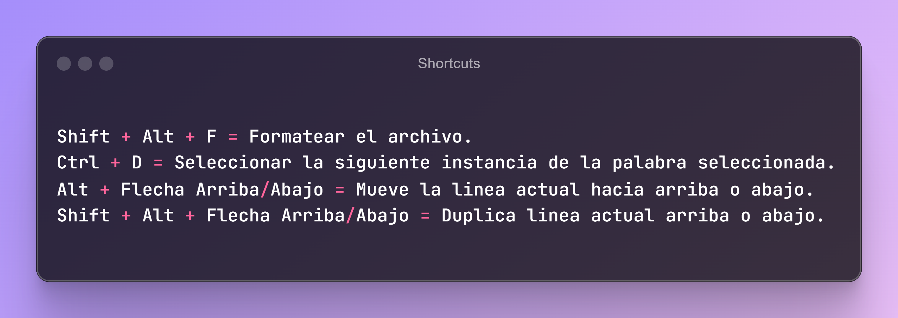

# Recursos para un programador

Este repositorio está dedicado a proporcionar una amplia variedad de recursos, herramientas y aprendizajes para desarrolladores de software.

### Copilot
- :rocket: [Black box](https://www.blackbox.ai/)
- :rocket: [You](https://you.com/)

### Libros
- :page_facing_up: [Clean Code Javascript](https://github.com/andersontr15/clean-code-javascript-es)
- :page_facing_up: [Clean Code Python](https://github.com/sryvcr/clean-code-python-es)
- :page_facing_up: [Design Patterns](https://refactoring.guru/es)
- :page_facing_up: [Building Microservices](https://github.com/namhoangduc99/TargetOf2018/blob/master/Sam%20Newman-Building%20Microservices-O'Reilly%20Media%20(2015).pdf)
- :page_facing_up: [Unit testing principles practices and patterns]()
- :page_facing_up: [Domain Driven Design](https://github.com/gg-daddy/ebooks/blob/master/Eric%20Evans%202003%20-%20Domain-Driven%20Design%20-%20Tackling%20Complexity%20in%20the%20Heart%20of%20Software.pdf)

### Iconos
- :grinning: [Yesicon App](https://yesicon.app/)
- :grinning: [Google Icons](https://fonts.google.com/icons)
- :grinning: [Bootstrap Icons](https://icons.getbootstrap.com/)

### Imagenes
- :framed_picture: 

### README Generador
- :pencil: [GPRM](https://gprm.itsvg.in/)
- :pencil: [Readme so](https://readme.so/es)
- :pencil: [Iconos](https://github.com/ikatyang/emoji-cheat-sheet)
- :pencil: [Badges](https://github.com/inttter/md-badges)

### REGExp
- :printer: [RegExr](https://regexr.com/)

### Diseño
- :paintbrush: [The Stockes](https://thestocks.im/)
- :paintbrush: [v0 By Vercel](https://v0.dev/)
- :paintbrush: [Collect UI](https://collectui.com/designs)
- :paintbrush: [Dribbble](https://dribbble.com/shots/4417684-Daily-UI-Landing-Page)

### Curriculo
- :clipboard: [ResumeGo](https://www.resumego.net/resume-checker/)

### CSS
- :apple: [Flexbox Froggy](https://flexboxfroggy.com/#es)
- :apple: [CSS Dinner](https://flukeout.github.io/)
- :apple: [Grid Garden](https://cssgridgarden.com/#es)
- :apple: [CSS Speedrun](https://css-speedrun.netlify.app/)
- :apple: [CSS Layout generator](https://layout.bradwoods.io/)
- :apple: [Grid Layoutit](https://grid.layoutit.com/)
- :apple: [Loading.io](https://loading.io/flexbox)
- :apple: [Griddy.io](https://griddy.io/)
- :apple: [CSS Grid Generator io](https://cssgridgenerator.io/)
- :apple: [My CSS Builder](https://www.mycssbuilder.com/)

### Colores
- :clipboard: [Coolors](https://coolors.co/)
- :clipboard: [UI Colors](https://uicolors.app/create)
- :clipboard: [My color space](https://mycolor.space/)

### Extensiones Chrome
- :toolbox: [Wappalzer](https://www.wappalyzer.com/)
- :toolbox: [SEO Meta in 1 Click](https://seo-extension.com/)
- :toolbox: [Visbug](https://visbug.web.app/)
- :toolbox: [Simulador Movil](https://www.webmobilefirst.com/es/)

### Extensiones VSC
- :keyboard: [Live Server](https://marketplace.visualstudio.com/items?itemName=ritwickdey.LiveServer)
- :keyboard: [Prettier](https://marketplace.visualstudio.com/items?itemName=esbenp.prettier-vscode)
- :keyboard: [Live Share](https://code.visualstudio.com/learn/collaboration/live-share)

### Fuentes
- :black_nib: [Google fonts](https://fonts.google.com/)
- :black_nib: [Fontjoy](https://fontjoy.com/)
- :black_nib: [Fontspace](https://www.fontspace.com/)

### Github repositorios
- :computer: [miduDev](https://github.com/midudev)
- :computer: [Frontend Joe](https://github.com/frontend-joe)
- :computer: [Bezkoder](https://github.com/bezkoder)
- :computer: [mtdvio (every-programmer-should-know)](https://github.com/mtdvio/every-programmer-should-know)

### Youtube canales
- :movie_camera: [OpenBootcamp](https://www.youtube.com/@OpenBootcamp/playlists)

### Herramientas
- :hammer: [Ray.so](https://www.ray.so/)

### Aprendizaje
 - :video_game: [Checkio](https://checkio.org/)
 - :video_game: [ZType](https://www.typing.com/es/student/game/ztype)

### Extras

