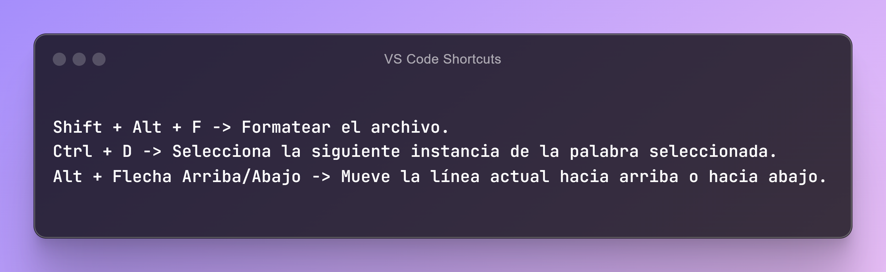

# Recursos para un programador

Este repositorio está dedicado a proporcionar una amplia variedad de recursos, herramientas y aprendizajes para desarrolladores de software.

### Copilot
- :rocket: [Black box](https://www.blackbox.ai/)
- :rocket: [You](https://you.com/)

### Libros
- :page_facing_up: [Clean Code Javascript](https://github.com/andersontr15/clean-code-javascript-es)

### Iconos
- :grinning: [Yesicon App](https://yesicon.app/)
- :grinning: [Google Icons](https://fonts.google.com/icons)
- :grinning: [Bootstrap Icons](https://icons.getbootstrap.com/)

### Imagenes
- :framed_picture: 

### README Generador
- :pencil: [GPRM](https://gprm.itsvg.in/)
- :pencil: [Readme so](https://readme.so/es)
- :pencil: [Iconos](https://github.com/ikatyang/emoji-cheat-sheet)

### REGExp
- :printer: [RegExr](https://regexr.com/)

### Diseño
- :paintbrush: [The Stockes](https://thestocks.im/)
- :paintbrush: [v0 By Vercel](https://v0.dev/)
- :paintbrush: [Collect UI](https://collectui.com/designs)
- :paintbrush: [Dribbble](https://dribbble.com/shots/4417684-Daily-UI-Landing-Page)

### Curriculo
- :clipboard: 

### CSS
- :apple: [Flexbox Froggy](https://flexboxfroggy.com/#es)
- :apple: [CSS Dinner](https://flukeout.github.io/)
- :apple: [Grid Garden](https://cssgridgarden.com/#es)
- :apple: [CSS Speedrun](https://css-speedrun.netlify.app/)
- :apple: [CSS Layout generator](https://layout.bradwoods.io/)
- :apple: [Grid Layoutit](https://grid.layoutit.com/)
- :apple: [Loading.io](https://loading.io/flexbox)
- :apple: [Griddy.io](https://griddy.io/)
- :apple: [My CSS Builder](https://www.mycssbuilder.com/)

### Colores
- :clipboard: [Coolors](https://coolors.co/)
- :clipboard: [UI Colors](https://uicolors.app/create)
- :clipboard: [My color space](https://mycolor.space/)

### Extensiones Chrome
- :toolbox: [Wappalzer](https://www.wappalyzer.com/)
- :toolbox: [SEO Meta in 1 Click](https://seo-extension.com/)
- :toolbox: [Visbug](https://visbug.web.app/)

### Extensiones VSC
- :keyboard: [Live Server](https://marketplace.visualstudio.com/items?itemName=ritwickdey.LiveServer)
- :keyboard: [Prettier](https://marketplace.visualstudio.com/items?itemName=esbenp.prettier-vscode)
- :keyboard: [Live Share](https://code.visualstudio.com/learn/collaboration/live-share)

### Fuentes
- :black_nib: [Google fonts](https://fonts.google.com/)
- :black_nib: [Fontjoy](https://fontjoy.com/)
- :black_nib: [Fontspace](https://www.fontspace.com/)

### Github repositorios
- :computer: 

### Youtube canales
- :movie_camera: [OpenBootcamp](https://www.youtube.com/@OpenBootcamp/playlists)

### Git
- :seedling: [gitignore.io](https://www.toptal.com/developers/gitignore)
- :seedling: [LearnGitBranching](https://learngitbranching.js.org/?locale=es_AR)
- :seedling: [Oh my git](https://ohmygit.org/)

### Herramientas
- :hammer: [Ray.so](https://www.ray.so/)

### Aprendizaje
 - :video_game: [Checkio](https://checkio.org/)

### Extras

