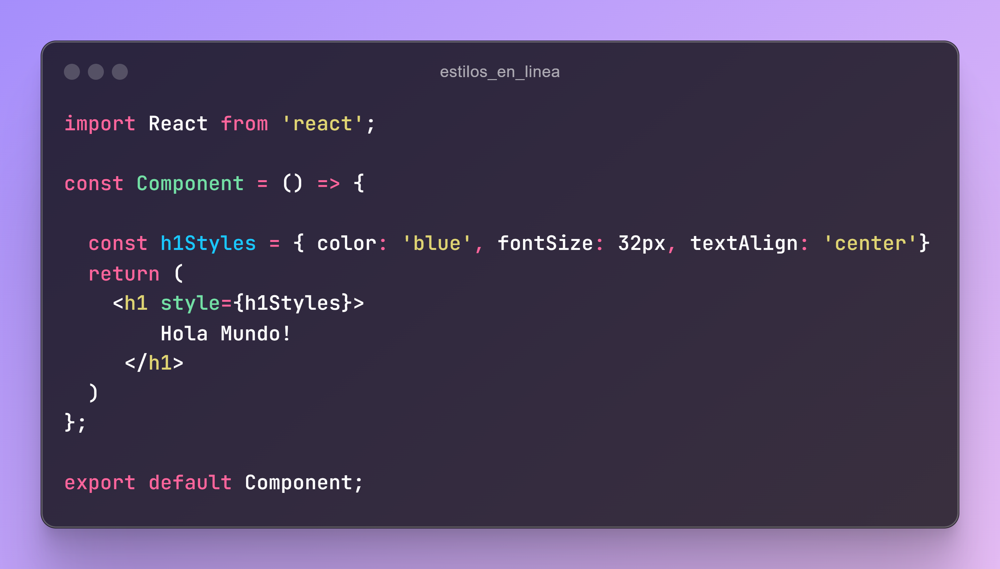
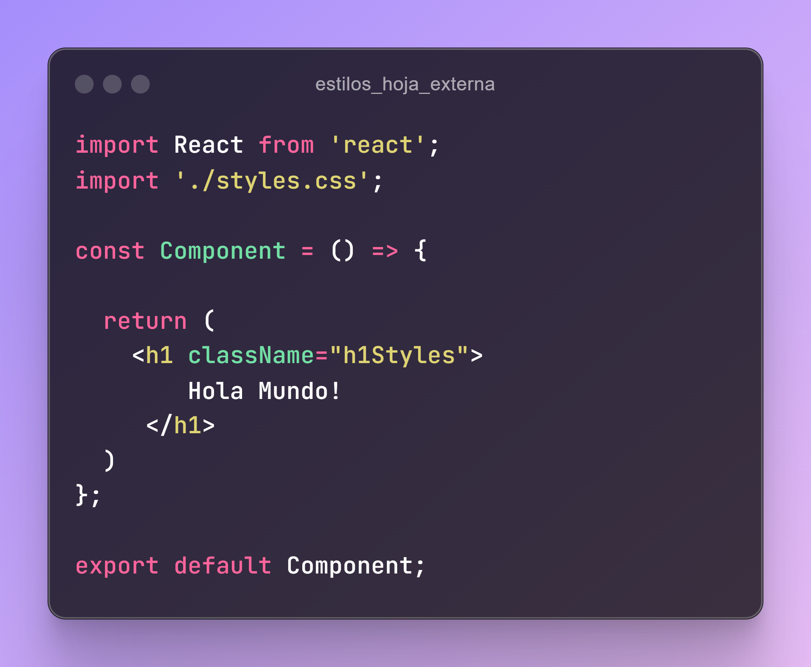

# Recursos para ReactJS

Este repositorio está dedicado a proporcionar una amplia variedad de recursos, herramientas y aprendizajes para desarrolladores con ReactJS.

### Librerias

### Arquitecturas

### Manejo de estilos
Existen varias formas y librerias para aplicar estilos.

1. Estilos en linea:

2. Estilos de hoja externa:

### Extensiones Chrome
- :toolbox: [React Develoepr Tools](https://chromewebstore.google.com/detail/react-developer-tools/fmkadmapgofadopljbjfkapdkoienihi)