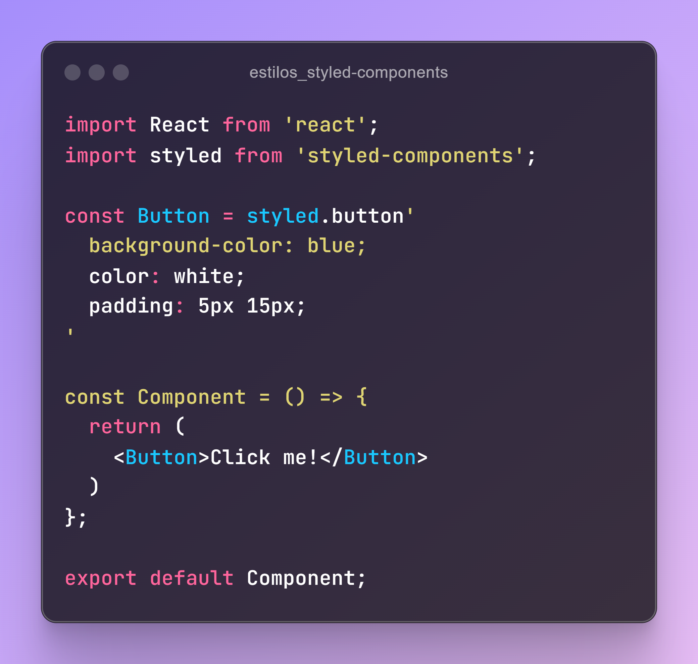

# Recursos para ReactJS

Este repositorio está dedicado a proporcionar una amplia variedad de recursos, herramientas y aprendizajes para desarrolladores con ReactJS.

### Librerias

### Arquitecturas

1. Type based

```bash
src/
|-- assets/
|   |-- fonts/
|   |-- images/
|-- components/
|   |-- header.js
|   |-- footer.js
|   |-- button.js
|-- pages/
|   |-- home.js
|   |-- about.js
|-- utils/
|-- styles/
|-- services/
|   |-- api.js
|   |-- auth.js
|-- App.css
|-- App.js
```

2. Feature based

```bash
src/
|-- assets/
|   |-- fonts/
|   |-- images/
|-- feature/
|   |-- auth/
|       |--components/
|       |--pages/
|       |--services/
|   |-- dashboard/
|       |--components/
|       |--pages/
|       |--services/
|-- shared/
|-- App.css
|-- App.js
```

### Manejo de estilos
Existen varias formas y librerias para aplicar estilos.

1. Estilos en linea:


2. Estilos de hoja externa:


3. Styled-componenst:



### Extensiones Chrome
- :toolbox: [React Develoepr Tools](https://chromewebstore.google.com/detail/react-developer-tools/fmkadmapgofadopljbjfkapdkoienihi)